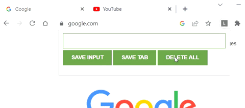

#Chrome Extension - Lead Tracker

JavaSript exercise from Srimba 

Goal of the extension is to save the input of current url of the visited page or any url we want to pass.

It contains exersizes how to use localStorage.

